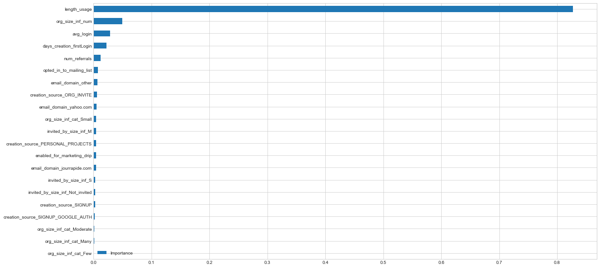
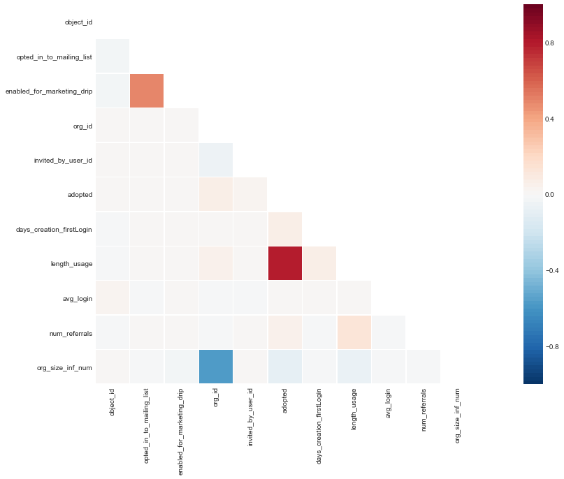

# Goal

We have investigate several features and identified the factors to predict the **adopted users** (who logged into the product on three separate days in at least one seven-day period).

# Feature Importance Graph

# Feature Correlation Heatmap

# Summary

We have performed two methods of the feature selection.

In the **feature correlation**, we have drawn the heat map and found that there are strong correlation between `adopted users` and `length_usage`. The `length usage` denotes the days from the first account creation to the last login time. This feature represents how a user consistenly has been used the services.

In the **feature impotance analysis**, we use inbuilt class feature_importances of tree based classifiers (e.g., *RandomForestClassifier* and *ExtraTreesClassifier*). The results of the order of important features is same in both tree based classifiers even thought the coefficients are different.
Likewise the results in the feature correlation, we see that the **`length_usage` is the strongest indicator for explaining the `adopted` users.** The feature importances are 0.83 (*RandomForestClassifier*) and 0.81 (*ExtraTreesClassifier*). 
The feature importance of the `adopted` feature was shown to be a big difference compared to other variables.

Next, we could observe that the features had the importance in the following order: 
`org_size_inf_num`, `avg_login`, `days_creation_firstLogin`, `num_refererals`, and `opted_in_to_mailing_list`.
Those indicate that the frequency of organizations, the average time of login intervals, the days between initial login and first creation, the number of user's referrals, and the subcription in the mailing list.
**All the highly impacting factors are related to customer's engagement to products.**

For the model results,
we obtain the best accuracy in the Logistic Regression model (Accuracy in 10-fold CV: 97.23).