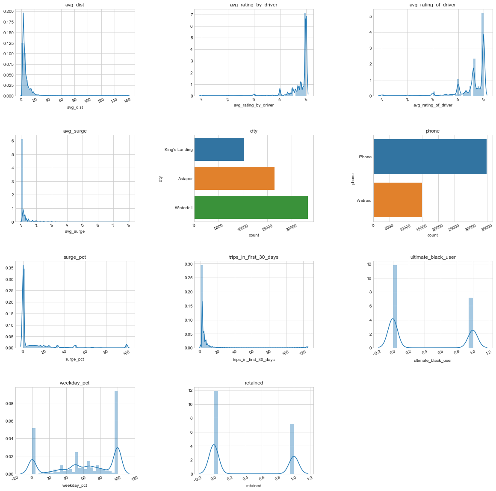
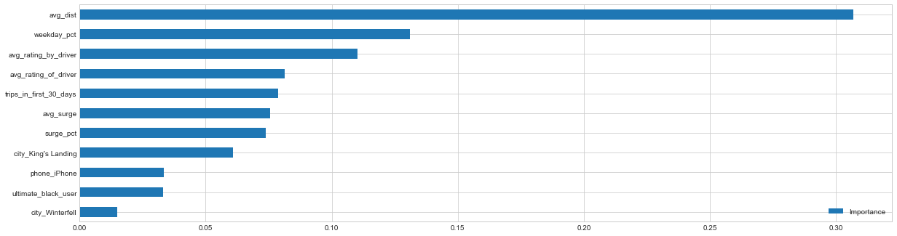
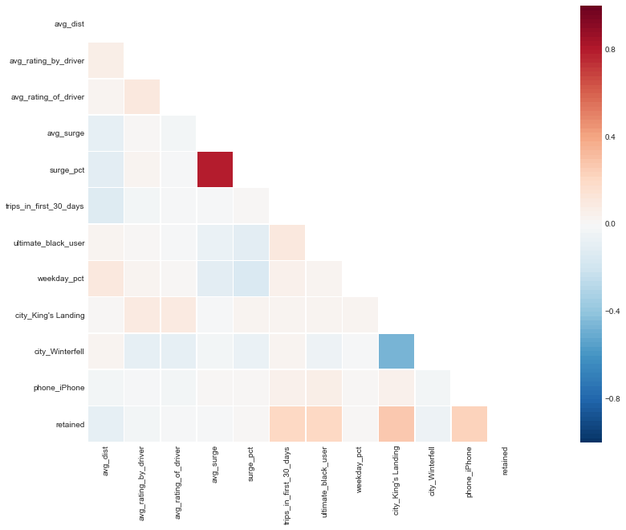

# Data Analysis Interview Challenge (Ultimate Inc.)

## Part 1. Exploratory Data Analysis

We have analyzed the login times by seasonl, weekdays, and hours.
We found that the logins most occur in Saturday and Sunday.

By investigating into hours, logins most occur at late night and (21 ~ 2). The logins start to increase from 21, peak at 22, decrease after 1. During the lunch time (11 ~ 12), logins increase for a while.

Combining weekdays and hours, we can see that most users log in most of the late nights and dawns on Sundays and Saturdays.

## Part 2. Experiment and Metrics Design

The neighboring cities of Gotham and Metropolis have complementary circadian rhythms: on
weekdays, Ultimate Gotham is most active at night, and Ultimate Metropolis is most active
during the day. On weekends, there is reasonable activity in both cities.

However, a toll bridge, with a two way
toll, between the two cities causes driver partners to tend
to be exclusive to each city. The Ultimate managers of city operations for the two cities have
proposed an experiment to encourage driver partners to be available in both cities, by
reimbursing all toll costs.

1. What would you choose as the key measure of success of this experiment in encouraging driver partners to serve both cities, and why would you choose this metric?  

 ==> I want to investigate if the "encouraging driver partners (by reimbursing all toll costs)" is effective in servicing both cities.  
The most important key measure of success will be the **revenue increase** for the Ultimate Inc.
The higher the `increased revenue`, the experiment "encouraging driver partners to serve in both cities" can be considered to be more successful. Please note that the metrics are measured on before and after encouraging driver partners then the difference as the success indicator is obtained.
    - `increased revenue`: revenue (costs of toll reimbursement should be deducted)

 In the aspects of the servicing both cities, we can measure the following metrics that can be regarded to as successful indicators.

 - `increased number of available drivers`: average number of available drivers when calling for the pickup,  
 - `decreased wait time`: average wait time when calling for the pickup, and  
 - `increased number of trips`: number of trips across the bridges.

2. Describe a practical experiment you would design to compare the effectiveness of the proposed change in relation to the key measure of success. Please provide details on:  
  a. how you will implement the experiment  
  
 ==> To investigate the effectiveness of the proposed change, I would compare two groups of drivers with/without reimbursements and measure the key measures mentioned above.
I would recommend dividing the drivers at random by 50\% and 50\% for each group, 
one for the drivers offered reimbursement and the other for remaining drivers continuing to operate without being reimbursed for tolls. 

  b. what statistical test(s) you will conduct to verify the significance of the observation   
  
 ==> To verify the significance of the observation, I perform the A/B test on those two groups.
I perform the t-test with a confidence level of 95\%, where the null hypothesis is the reimbursing drivers for tolls does not have a statistically significant impact on Ultimate's net profits.

  c. how you would interpret the results and provide recommendations to the city operations team along with any caveats.   
  
  ==> If the `increased revenue` is positive, then it is effective to encourage driver partners by reimbursing toll costs. If the `increased revenue` is negative, they should not adopt the toll cost reimbursement. Even it is revealed the `increased revenue` is positive, the drivers have randomly chosen, and it may not be effective in all cases. We need more rigorous experiments by different variables (e.g., selecting other drivers, differnt portions, different days, etc.)

## Part 3. Predictive Modeling

**We have investigate several features and identified the factors to predict the retained users.**

### Distribution of Each Feature

### Feature Importance Graph

### Feature Correlation Heatmap

### Summary

We have performed two methods of the **feature selection.**

In the **feature correlation**, we have drawn the heat map and found that **there are strong correlation between surge percent and average surge.**

In the **feature impotance analysis**, we use inbuilt class `feature_importances` of tree based classifiers (e.g., *RandomForestClassifier*).
In the feature importance analysis, we can find the important features affecting on the target variable of retained users (`retained`). 

- The average distance (`avg_dist`) in the most major important indicator for predicting a retained user.
- The percentage of the user's trips occurring durinng a weekday (`weekday_pct`) and the rider's average rating over all of their trips (`avg_rating_by_driver`) are also important indicators. 
  - The users who has high usages on weekdays may use the Ultimate cars as main vehicles for commuting (or may not own their own cars). 
  - The users who receive the high ratings can be more considered to be engaged in this service. 
  - ==> So, it may be effective to issue the promotional coupons or discounts for highly rated users or high weekday usage users.
- The rest features are also important in the following order.
  - `surge_pct`, `avg_rating_of_driver`, `trips_in_first_30_days`, `avg_surge`, `city_King's Landing`, `phone_iPhone`, `ultimate_black_user`, and `city_Winterfell`
    
For the model results,
we obtain the best accuracy in the Gradient Boosting Trees model (Accuracy in 10-fold CV: 78.78). The accuracy needs to be improved using more rich data and features.